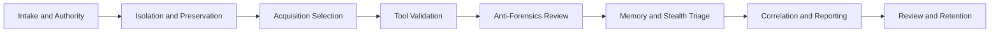

# Architecture

The platform follows a compact PHP 8 architecture that can run as a simple built-in-server application, an Apache container, or a traditional PHP deployment.

## Layers

- `public/index.php` handles routing, forms, API entry points, and page rendering.
- `src/Service/ForensicsLabService.php` contains scoring, method ranking, wiping evaluation, and evidence-ledger logic.
- `src/Repository/LabRepository.php` exposes catalog data and optional MySQL persistence.
- `config/catalog.php` defines research sources, evidence features, acquisition methods, tool profiles, wiping artifacts, workflow stages, and forensic controls.
- `database/migrations` and `database/seeders` provide the MySQL 8 schema and starter reference data.

## Casework Flow

## Scoring Model

Case readiness combines three inputs:

- Control coverage: weighted controls across governance, evidence handling, integrity, acquisition, memory, malware, anti-forensics, analysis, reporting, and operations.
- Method coverage: completed methods such as logical acquisition, physical imaging, memory acquisition, cloud acquisition, and static or dynamic review.
- Case context: locked device, deleted-data need, cloud relevance, suspected malware, volatile evidence need, suspected wiping, court-facing reporting, and privacy sensitivity.

The output includes a readiness score, residual risk tier, priority controls, method sequence, report outline, and next actions.

## Method Comparison

Each acquisition or analysis method is scored against nine evidence features. Context adjustments raise or lower the score when deleted data, cloud evidence, malware behavior, volatile memory, file wiping, lock state, or formal reporting changes the evidence need.

This produces:

- Ranked method list
- Primary, supporting, targeted, or limited role labels
- Best method by evidence feature
- Evidence gap recommendations

## Evidence Ledger

The ledger accepts a manifest of `path` and `sha256` values. Entries are normalized, sorted, converted to leaf hashes, and folded into a deterministic Merkle-style root. The root is suitable for chain-of-custody checkpoints, report appendices, and peer review.

