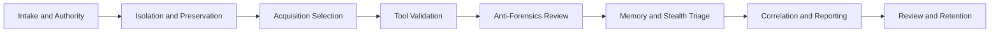

# Architecture

The platform follows a compact PHP 8 architecture that can run as a simple built-in-server application, an Apache container, or a traditional PHP deployment.

## Layers

- `public/index.php` handles routing, forms, API entry points, and page rendering.
- `src/Service/ForensicsLabService.php` contains scoring, command workbench, timeline fusion, method ranking, wiping evaluation, and evidence-ledger logic.
- `src/Repository/LabRepository.php` exposes catalog data and optional MySQL persistence.
- `config/catalog.php` defines research sources, evidence features, acquisition methods, tool profiles, wiping artifacts, workflow stages, and forensic controls.
- `database/migrations` and `database/seeders` provide the MySQL 8 schema and starter reference data.

## Casework Flow

## Scoring Model

Case readiness combines three inputs:

- Control coverage: weighted controls across governance, evidence handling, integrity, acquisition, memory, malware, anti-forensics, analysis, reporting, and operations.
- Method coverage: completed methods such as logical acquisition, physical imaging, memory acquisition, cloud acquisition, and static or dynamic review.
- Case context: locked device, deleted-data need, cloud relevance, suspected malware, volatile evidence need, suspected wiping, court-facing reporting, and privacy sensitivity.

The output includes a readiness score, residual risk tier, priority controls, method sequence, report outline, and next actions.

## Method Comparison

Each acquisition or analysis method is scored against nine evidence features. Context adjustments raise or lower the score when deleted data, cloud evidence, malware behavior, volatile memory, file wiping, lock state, or formal reporting changes the evidence need.

This produces:

- Ranked method list
- Primary, supporting, targeted, or limited role labels
- Best method by evidence feature
- Evidence gap recommendations

## Command Workbench

The command workbench converts scenario signals into an examiner-ready mission plan. It evaluates lock state, unlock availability, deleted-data need, cloud relevance, suspected malware, volatile evidence, wiping suspicion, active network risk, native libraries, encrypted messaging, external storage, recent user activity, and report posture.

Outputs include:

- Mission profile
- Urgency score and tier
- Ranked method stack with rationale
- Operational lanes for preservation, acquisition, decoding, reverse review, recovery, and reporting
- Evidence constellation with feature roles and validation actions
- Decision cards and validation backlog

## Timeline Fusion

Timeline fusion accepts mixed-source Android events as JSON. Events are normalized, sorted, confidence-scored, clustered by time window, and reviewed for anomalies such as low source diversity, invalid timestamps, low confidence, duplicate hashes, chronological normalization, and long gaps.

The result gives examiners a set of high-confidence anchors and reconstruction steps suitable for reporting.

## Evidence Ledger

The ledger accepts a manifest of `path` and `sha256` values. Entries are normalized, sorted, converted to leaf hashes, and folded into a deterministic Merkle-style root. The root is suitable for chain-of-custody checkpoints, report appendices, and peer review.
